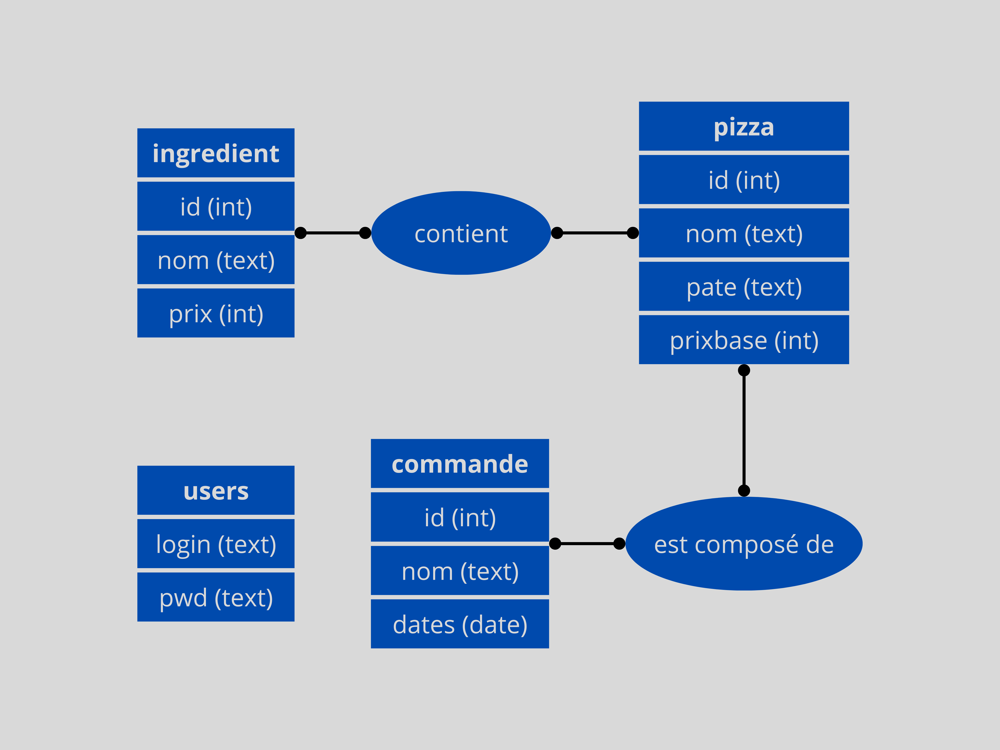

# SAE_REST_GroupeH_MILLEVILLE_MARTEL

## Membres du groupe

- Martel Alexandre
- Milleville Paul

# La Documentation  d'API

- [Documentation API ingrédient](./Documentation/Doc_API_Ingredient.md)
- [Documentation API pizza](./Documentation/Doc_API_Ingredient.md)
- [Documentation API commande](./Documentation/Doc_API_Ingredient.md)

# Authentification pour les API

L'authentication est nécéssaire pour toutes les requetes modifiants les données, donc toutes les requêtes excéptées les requêtes **GET**. Pour s'authentifier, il faut accéder a l'URL /users/token et se connecter avec son login mot de passe. Alors, sera afficher à l'écran le token qu'il faudra garder pour modifier les données. Pour faire cela, il faut mettre une en-tête à votre requête s'appellant token et lui associer votre token.

# MCD

# MLD

### Entités :

#### Users (<u>login, pwd</u>)
- **Login** (Clé primaire)
- Pwd

#### Ingredien (<u>id</u>, nom, prix)
- **Id** (Clé primaire)
- Nom
- Prix

#### Pizza (<u>id</u>, nom, pate, prixbase)
- **Id** (Clé primaire)
- Nom
- Pate
- Prixbase

#### Commande (<u>id</u>, nom, dates)
- **Id** (Clé primaire)
- Nom
- Dates

### Relations :

#### Pizza_Ingredient (<u>#pizza_id, #ingredient_id</u>)
- **Pizza_Id** (Clé étrangère vers Pizza)
- **Ingredient_Id** (Clé étrangère vers Ingredient)

#### Commande_Pizza (<u>#pizza_id, commande_id</u>)
- **Pizza_Id** (Clé étrangère vers Pizza)
- **Commande_Id** (Clé étrangère vers Commande)